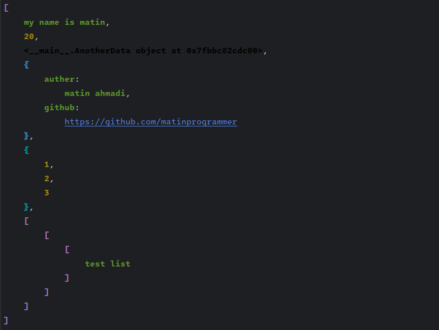

# MPrint, CPrint
you can use easy like print but this print has indent and color
that create better readable for you

## Features:
+ indent data you use
+ colorize your data
+ write data with indent in file so easy

# Example:
    class AnotherData:
        pass
    string_data = "my name is matin"
    int_data = 20
    another_data = AnotherData()
    dict_data = {"auther": "matin ahmadi", "github": "https://github.com/matinprogrammer"}
    set_data = {1, 2, 3}
    list_data = [string_data, int_data, another_data, dict_data, set_data, [[["test list"]]]]

`>>> mprint(list_data)`

`>>> cprint(list_data)`

    